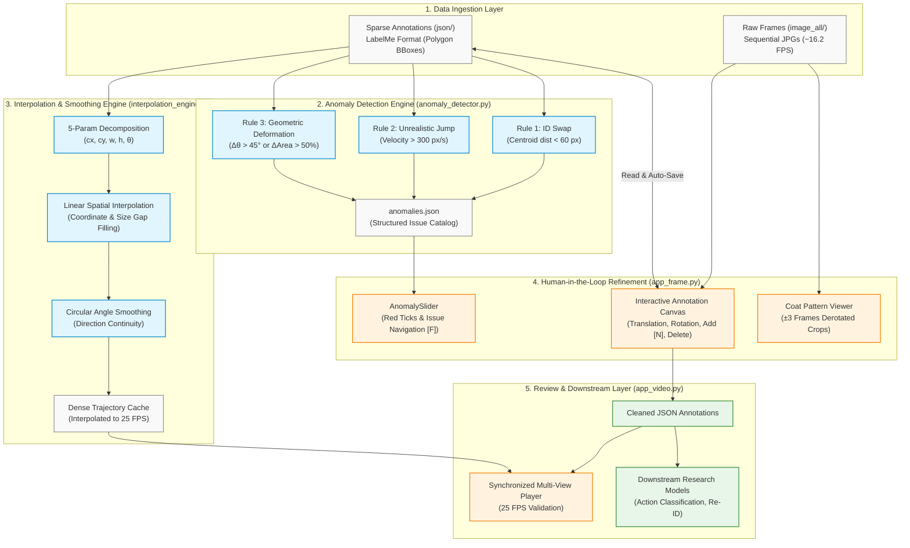
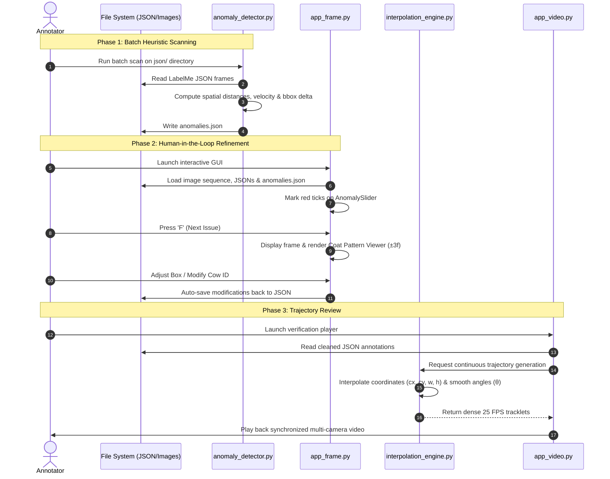

# System Architecture & Design

This document details the software architecture, data pipelines, and component interactions of the Cattle Tracklet Refinement and Anomaly Detection System.

---

## 1. High-Level System Architecture

The system is organized into a five-tier architecture covering data ingestion, heuristic error scanning, trajectory interpolation, human-in-the-loop manual refinement, and downstream validation:

---

## 2. Component Specifications

### 2.1 Data Storage Layer (`image_all/` & `json/`)
* **Image Sequences**: Multi-camera sequential frames extracted at source frame rates (default ~16.2 FPS).
* **LabelMe JSON Format**: Stores sparse bounding box coordinates, class labels (`"cow"`), and persistent tracking identities (`group_id`).

### 2.2 Anomaly Detector (`anomaly_detector.py`)
A batch heuristic processing pipeline acting as a high-recall filter:
* **ID_SWAP**: Detects spatial identity collisions where bounding boxes with distinct IDs have centroids closer than a Euclidean distance threshold ($d < 60\text{ px}$) across adjacent frames.
* **UNREALISTIC_JUMP**: Evaluates spatial velocity per cow ID ($v = \frac{\Delta \text{dist}}{\Delta t}$) and flags movements exceeding realistic biological bounds ($v > 300\text{ px/s}$).
* **GEOMETRIC_DEFORMATION**: Monitors rapid rotation variance ($\Delta \theta > 45^\circ$) or sudden area fluctuations ($\Delta A > 50\%$) derived via `cv2.minAreaRect`.

### 2.3 Interactive Annotation UI (`app_frame.py`)
Built on **PyQt6** for fast desktop rendering:
* **`AnomalySlider`**: Custom `QSlider` dynamically rendering red tick marks at anomaly frame locations based on `anomalies.json`.
* **Coat Pattern Viewer**: Renders cropped, de-rotated bounding box patches across $\pm 3$ frames relative to the current position to verify pelage patterns without leaving the focus area.
* **Interactive Canvas**: Translates click-and-drag interactions into bounding box displacements and rotation angles ($\pm 1^\circ$ or $\pm 5^\circ$) with instant serialization to JSON.

### 2.4 Interpolation & Smoothing Engine (`interpolation_engine.py`)
* Converts discrete 4-point bounding boxes into 5 degrees of freedom $(cx, cy, w, h, \theta)$.
* Interpolates sparse ground truth keyframes (e.g., 1 Hz) into continuous 25 FPS tracklets using linear interpolation for spatial parameters and circular angle interpolation for heading angles.

---

## 3. Data Flow & Interaction Sequence

